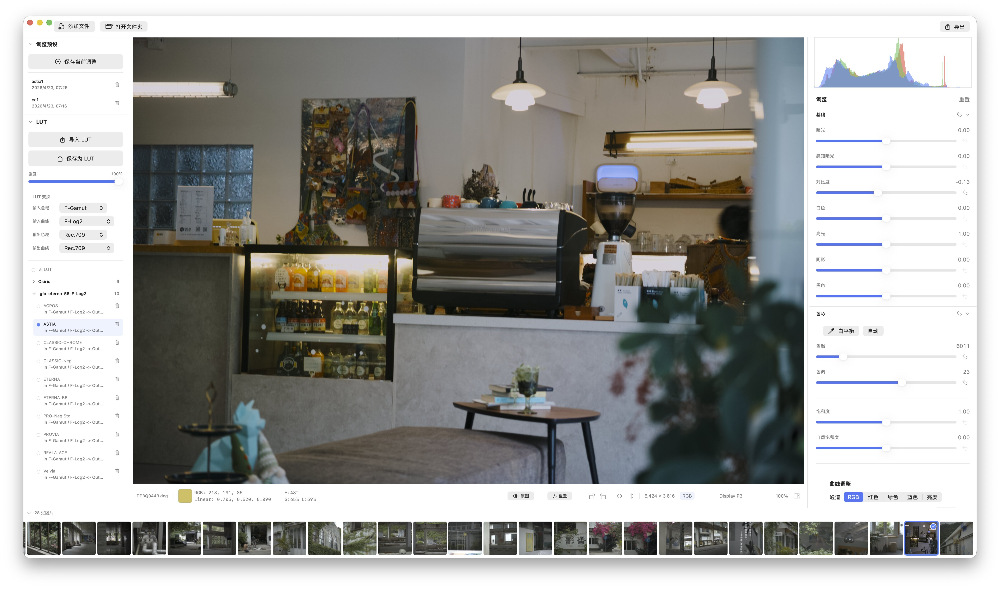

# RawKit

RawKit 是面向 macOS 的本地图像处理工具，重点解决一个常见但很难被现有软件完整覆盖的问题：**从 RAW、Sigma X3F、Sony JPG 等来源得到可信的 HDR / LUT / 宽色域导出结果，并能检查导出文件的底层元信息是否真的正确**。

## 为什么不可替代

- **支持适马 X3F**：支持 X3F 解析、预览、调色和导出，减少先转 DNG、再进其他软件、最后再导出的来回折腾。
- **LUT 支持**：每个 LUT 都能指定输入色域、输入曲线、输出色域和输出曲线。
- **HDR 导出**：支持 HEIF、AVIF、Ultra HDR JPEG 等 HDR 输出，并提供检查脚本确认文件是否真的写对，减少发到平台后变灰、变暗或不点亮 HDR。
- **批量处理**：可以同步调整、套用 LUT、使用导出预设、限制尺寸、统一命名和批量导出，减少重复操作。

## 主要能力

- 支持 RAW、X3F、JPEG、PNG、TIFF、HEIF、AVIF 等输入。
- 支持曝光、白平衡、曲线、LUT、清晰度、去雾、锐化和构图调整。
- 支持 SDR sRGB、Display P3 SDR、Display P3 HLG/PQ HDR、Rec.2020 HLG/PQ HDR 输出预设。
- 支持 TIFF、JPEG、HEIF、AVIF、Ultra HDR JPEG、DNG 导出。
- 提供 HEIF、AVIF、Ultra HDR JPEG 和 Exif 对比检查脚本。

完整功能列表见 [docs/features.md](docs/features.md)。

## 技术栈

- Swift 5
- SwiftUI
- Core Image
- CGImageSource / CIRAWFilter
- Actor 并发模型

## 系统要求

- macOS 15.1+
- Xcode 16.2+
- 8GB 以上内存更适合大尺寸 RAW 处理

## 截屏

